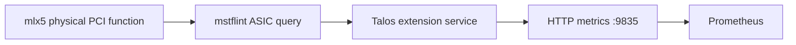

# talos-mellanox-temperature-exporter

Prometheus metrics for Mellanox NIC **ASIC temperature**, packaged as a Talos
system extension and an ordinary Linux container. Useful when a NIC can report
its temperature through firmware but the Linux `mlx5` hwmon interface exposes
no sensor.

No cluster names, inventory, credentials, or external configuration repository
are required. By default, the exporter discovers Mellanox PCI physical functions
bound to `mlx5_core`. It excludes virtual functions and functions bound to other
drivers. An explicit PCI allowlist can limit collection further. Interfaces that
share one PCI function produce one temperature series for that function.

**Status:** initial implementation; Linux amd64 packaging and automated tests
are validated. A ConnectX-4 has returned real ASIC temperatures through the exporter and
NVIDIA reader. The extension filesystem and service configuration pass Talos
1.12.6 validation; installation and boot lifecycle still need validation. Do not infer support for every Mellanox generation from this
one device family. Optical/transceiver temperatures are not collected.

## Where it runs

The Talos image is installed as a **system extension in the node's OS image**.
Talos supervises `ext-nic-temperature` in its system container runtime; Kubernetes
does not schedule it. The service polls the hardware independently of Prometheus
requests and exposes `/metrics` on port 9835. No kernel module, replacement
network driver or proprietary NVIDIA MFT package is installed.

Adding or upgrading the extension requires rebuilding the Talos installer image
and performing a Talos installation/upgrade with a reboot. A machine-config
update alone cannot install its binaries. Preserve the node's existing extension
set when building that installer. See [Talos system extensions](https://docs.siderolabs.com/talos/v1.12/build-and-extend-talos/custom-images-and-development/system-extensions)
and [packaging details](PACKAGING.md).



## Build and test

The Go exporter has no third-party Go dependencies. The Docker build pins its
compiler image and mstflint source archive, and produces static binaries without
installing extra packages from mutable package repositories.

```sh
go test -race ./...
go vet ./...

docker build --target test -t nic-temperature-test .
docker build --target exporter -t nic-temperature-exporter:dev .
docker build --target talos-extension -t nic-temperature-extension:dev .
```

The **last/default Docker target is the Talos extension**; choose the target
explicitly. Image publication is not automatic. Build and publish to your chosen
registry, then use its immutable digest in your Talos installer build. See
[PACKAGING.md](PACKAGING.md) for source pins, rootfs layout, licenses and
installation checks.

## Configuration

| CLI flag | Environment variable | Default |
|---|---|---|
| `--listen-address` | `MELLANOX_TEMPERATURE_LISTEN_ADDRESS` | `:9835` |
| `--interval` | `MELLANOX_TEMPERATURE_POLL_INTERVAL` | `60s` |
| `--timeout` | `MELLANOX_TEMPERATURE_QUERY_TIMEOUT` | `20s` |
| Repeated `--device` | `MELLANOX_TEMPERATURE_PCI_DEVICES` (comma-separated) | Discover eligible physical functions |
| `--temperature-command` | — | `/usr/local/bin/mstmget_temp` |
| `--sysfs-root` | — | `/sys` |

`--interval` is the delay **after a polling cycle completes**, so a slow query
extends the time between readings. Queries run sequentially and never overlap.
Require `interval >= timeout >= 1s`. PCI addresses use lowercase `dddd:bb:ss.f`.
At most 64 functions may be collected; an allowlist is required beyond that.
CLI values override environment defaults; a CLI allowlist replaces the environment
allowlist. Invalid environment durations are rejected at startup.

`--sysfs-root` changes inventory lookup only. The NVIDIA command accesses its
native `/sys` PCI paths, which must refer to the same hardware. Use this option
only when those views are deliberately aligned.

A Talos configuration document can supply environment overrides to the installed
extension service:

```yaml
apiVersion: v1alpha1
kind: ExtensionServiceConfig
name: nic-temperature
environment:
  - MELLANOX_TEMPERATURE_POLL_INTERVAL=60s
  - MELLANOX_TEMPERATURE_QUERY_TIMEOUT=20s
  # Optional: omit to discover mlx5 physical functions.
  - MELLANOX_TEMPERATURE_PCI_DEVICES=0000:01:00.0
```

See the [Talos ExtensionServiceConfig reference](https://docs.siderolabs.com/talos/v1.12/reference/configuration/extensions/extensionserviceconfig).
Restart the extension service after applying configuration and verify the running
settings in its startup log. Default settings also work without this document.

## Privileges and endpoint access

The vendor GET operation needs writable PCI configuration-space access for its
command/semaphore transport. **A read-only sysfs mount is insufficient.** The
generic Talos service is privileged and enables writable sysfs; its root
filesystem remains read-only and `/tmp` is a bounded tmpfs for command lockfiles.
Only `mstmget_temp -d PCI_ADDRESS --no-modules` is executed. No client request can
choose a command, device, or polling interval.

The ordinary container requires an administrator to grant appropriate host PCI
access. A narrowly configured host can expose only selected PCI paths writable.
Do not give it an entire writable host root. Runtime/SELinux requirements vary;
see [PACKAGING.md](PACKAGING.md).

The HTTP endpoint has no authentication or TLS. Bind it to the monitoring
network or restrict access with host/network policy. `/healthz` reports that the
HTTP process is alive; use the collection metrics below for hardware health.

## Metrics

| Metric | Meaning |
|---|---|
| `mellanox_temperature_celsius{pci_address}` | Fresh successful ASIC reading, in Celsius |
| `mellanox_temperature_device_info{pci_address,interfaces,device_id,firmware,board_id}` | Identity; optional metadata can be empty |
| `mellanox_temperature_device_collection_success{pci_address}` | 1 only while this device's latest reading is successful and fresh |
| `mellanox_temperature_device_last_success_timestamp_seconds{pci_address}` | Unix time of its last successful query; 0 before its first success |
| `mellanox_temperature_collection_success` | 1 when discovery and every selected device's latest reading succeeded recently; 0 with no devices |
| `mellanox_temperature_discovery_success` | Whether the latest inventory pass succeeded and is recent |
| `mellanox_temperature_devices` | Number of functions in the current snapshot |

A failed query omits its temperature rather than retaining the last value or
substituting zero. Readings also expire after `2 * interval + timeout`. Last-success
time remains available during failures. A removed device disappears on the next
successful automatic discovery; an explicitly configured missing device remains
a failed target. Discovery failure invalidates all prior temperatures.

Prometheus should attach host identity through its target labels. For example:

```yaml
scrape_configs:
  - job_name: mellanox-temperature
    scrape_interval: 30s
    static_configs:
      - targets: [worker.example.net:9835]
        labels:
          node: worker.example.net
```

Use `mellanox_temperature_collection_success == 0` to find failed collection,
and `time() - mellanox_temperature_device_last_success_timestamp_seconds` for
reading age. Collection success does not prove the NIC is cool: choose temperature
limits for the actual adapter model. ASIC and optical-module limits differ.

## License

Exporter source: [MIT](LICENSE). The image retains upstream mstflint licensing
and attribution under `/usr/share/licenses/mstflint`; those terms apply to the
bundled vendor reader independently of this project's license.
